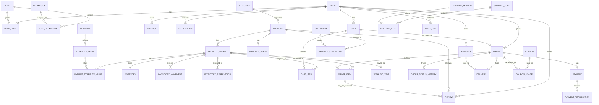
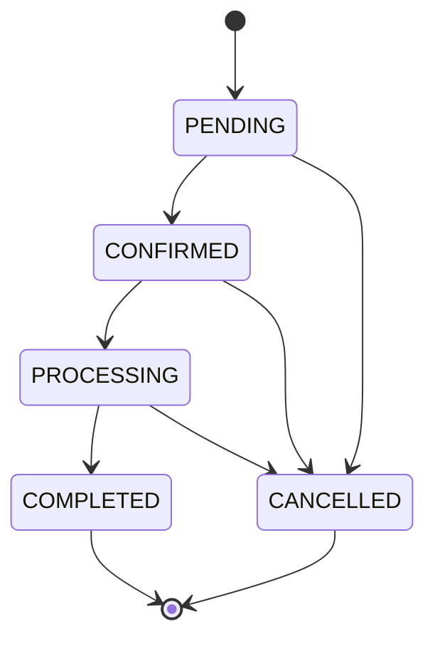
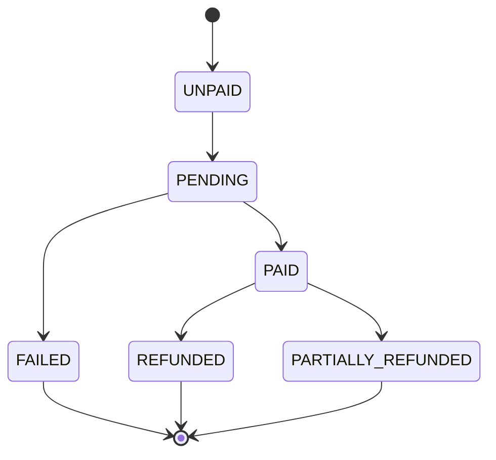
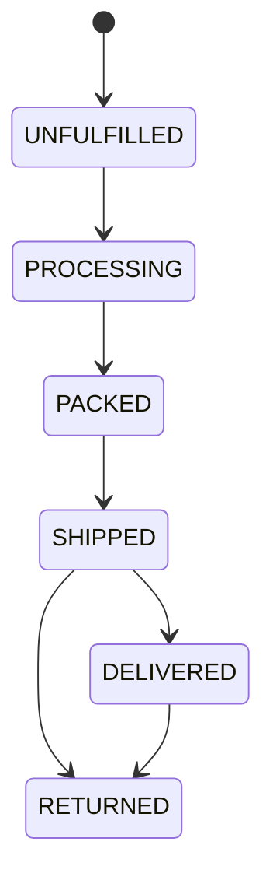
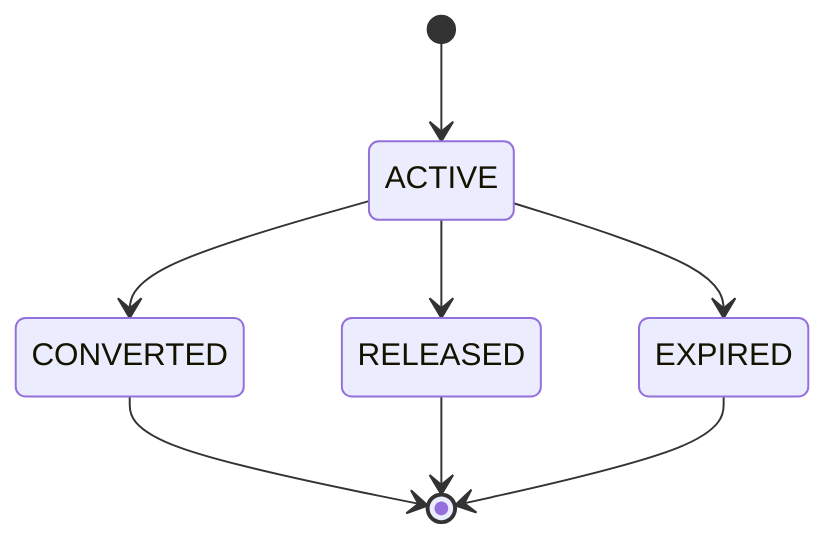

# PHASE 0 — REPOSITORY AUDIT + ARCHITECTURE + ERD

## 1. Executive Summary

This repository is effectively empty at the time of audit. The workspace contains only a blank `report.md` file and no application source, dependency manifests, backend code, database schema, migrations, tests, or deployment configuration. Because of this, the repository has no verified implementation to assess beyond the absence of structure.

The result is a clean-sheet architecture opportunity. The platform can be designed deliberately around the required domain boundaries: Product → Product Variant → Inventory → Cart → Checkout → Order → Payment → Fulfillment → Delivery. This is consistent with production e-commerce requirements and avoids the common anti-pattern of collapsing inventory, cart, and order concepts into a single table or service.

No implementation should begin until the architecture is approved. The primary decision is whether to adopt a simple monorepo or a lightweight app/package split. Given the repository is empty, the preferred direction is a pragmatic, API-first architecture using Next.js for storefront/admin web and a Fastify + TypeScript API with PostgreSQL and Prisma.

Because the project is Kenya-first, M-Pesa must be treated as a pluggable payment provider rather than a hard-coded domain assumption. Delivery must be configurable by zone and shipping method. Authentication must be secure, cookie-based, and RBAC-aware. Inventory must be variant-level with reservation and conversion timing to prevent overselling.

The most important gap is not just missing code; it is the absence of any architectural foundation, environment setup, or database model. A large part of Phase 0 is therefore defining the target state and the execution sequence required to build it safely.

This report documents the repository state, identifies the critical gaps, and defines the production-ready architecture that should be approved before Phase 1 begins.

---

## 2. Repository Inventory

### Verified current state

| Area | Status | Evidence | Assessment |
| --- | --- | --- | --- |
| Repository root | Empty aside from blank report file | `ls -la` and file scan | No application or config exists |
| Source code | Absent | No `src/`, `app/`, `pages/`, `server/`, `api/`, `components/` etc. found | No verified framework or app structure |
| Package manifest | Absent | No `package.json` found | No Node.js app yet |
| Frontend framework | UNKNOWN | No files discovered | Requires decision |
| Backend framework | UNKNOWN | No server code discovered | Requires decision |
| Database | UNKNOWN | No Prisma/Drizzle schema or migrations found | Requires decision |
| ORM | UNKNOWN | No prisma/drizzle files found | Requires decision |
| Authentication | UNKNOWN | No auth implementation found | Requires design |
| API structure | UNKNOWN | No route handlers found | Requires design |
| Tests | Absent | No test files or config found | No test harness |
| Docker | Absent | No `docker/`, `Dockerfile`, or compose files found | No deployment scaffolding |
| Environment config | Absent | No `.env.example` found | No environment model |
| Documentation | Minimal | Only blank `report.md` present | No product architecture docs |

### Known unknowns

- Framework: UNKNOWN — REQUIRES BUSINESS DECISION
- Language: UNKNOWN — REQUIRES BUSINESS DECISION
- Package manager: UNKNOWN — REQUIRES BUSINESS DECISION
- Frontend architecture: UNKNOWN — REQUIRES BUSINESS DECISION
- Backend architecture: UNKNOWN — REQUIRES BUSINESS DECISION
- Database engine: UNKNOWN — REQUIRES BUSINESS DECISION
- ORM: UNKNOWN — REQUIRES BUSINESS DECISION
- Authentication scheme: UNKNOWN — REQUIRES BUSINESS DECISION
- API pattern: UNKNOWN — REQUIRES BUSINESS DECISION

---

## 3. Current Architecture

No implementation is present. Therefore the current architecture is effectively:

- No application layer
- No UI layer
- No API layer
- No data access layer
- No persistence layer
- No deployment pipeline
- No security controls
- No test suite

This is not a partially implemented system. It is a blank repository requiring architecture and implementation from scratch.

### Frontend

No frontend stack detected. This means the project has no evidence of:

- Next.js
- Vite
- React Router
- server-side rendering decisions
- form libraries
- state management approach
- UI component library
- styling framework

### Backend

No backend detected. This means the project has no evidence of:

- Express / Fastify / NestJS
- route organization
- controllers/services/repositories
- middleware
- validation strategy
- authorization model

### Database

No database schema, migration system, or ORM artifacts were found. There is no evidence of PostgreSQL, MySQL, SQLite, Prisma, or Drizzle.

### Infrastructure

No environment files, CI/CD config, Docker files, or external service integrations are present.

---

## 4. Current Feature Inventory

The repository does not currently contain any confirmed features.

The following are therefore treated as planned product capabilities, not existing features:

- Product browsing: UNKNOWN — REQUIRES BUSINESS DECISION
- Search/filtering: UNKNOWN — REQUIRES BUSINESS DECISION
- Categories and collections: UNKNOWN — REQUIRES BUSINESS DECISION
- Cart management: UNKNOWN — REQUIRES BUSINESS DECISION
- Checkout: UNKNOWN — REQUIRES BUSINESS DECISION
- User authentication: UNKNOWN — REQUIRES BUSINESS DECISION
- M-Pesa integration: UNKNOWN — REQUIRES BUSINESS DECISION
- Admin dashboard: UNKNOWN — REQUIRES BUSINESS DECISION
- Inventory management: UNKNOWN — REQUIRES BUSINESS DECISION
- Delivery configuration: UNKNOWN — REQUIRES BUSINESS DECISION

No feature can be claimed as implemented without actual source evidence.

---

## 5. Current Database Analysis

No database analysis is possible beyond the absence of database artifacts.

This includes:

- No schema files
- No migration files
- No entity definitions
- No indexes
- No seed system
- No constraints
- No evidence of PostgreSQL or Prisma configuration

The database must be designed from first principles for the e-commerce domain.

---

## 6. Technical Debt

Because there is no existing application, the immediate technical debt is structural rather than legacy debt.

### Structural debt

- No app foundation
- No agreed stack
- No architecture documentation
- No database model
- No auth architecture
- No payment abstraction
- No inventory rules
- No deployment standard

### Decision debt

- Single-store vs multi-store or marketplace
- Product/variant inventory model
- Guest vs authenticated cart split
- Payment provider strategy
- Delivery-zone strategy
- Admin/role model
- Soft-delete policy

---

## 7. Security Findings

The repository currently has no meaningful security posture because there is no application code. The following are critical risks if implementation begins without architecture approval:

### Critical

- No auth framework or session strategy
- No RBAC design
- No secrets management strategy
- No input validation architecture
- No webhook verification design for M-Pesa
- No audit logging strategy
- No secure cookie policy
- No rate limiting model

### High

- No CSRF protection plan
- No SQL injection prevention strategy at the ORM layer
- No file-upload security requirements
- No admin privilege boundaries
- No role-authorization enforcement design

### Medium

- No API versioning model
- No environment isolation plan
- No error-handling policy
- No logging retention model

### Low

- No metadata or SEO policy yet, which is acceptable before implementation

---

## 8. Architecture Gaps

### Functional gaps

- No product catalog model
- No stock/inventory model
- No order lifecycle model
- No checkout flow definitions
- No payment abstraction
- No delivery configuration model
- No review or wishlist model
- No admin access model

### Technical gaps

- No monorepo or app split defined
- No database migration strategy defined
- No test strategy defined
- No deployment strategy defined
- No CI/CD workflow defined
- No environment management defined

---

## 9. Target Architecture

### Recommended stack

#### Frontend

- Next.js
- TypeScript
- Tailwind CSS
- shadcn/ui
- React Hook Form
- Zod
- TanStack Query
- Zustand only where true client state is required

#### Backend

- Node.js
- TypeScript
- Fastify

#### Database

- PostgreSQL

#### ORM

- Prisma

#### Auth

- Secure cookie-based session/auth model
- Short-lived access/session credentials where appropriate
- Refresh strategy with rotation
- RBAC-based authorization

#### Media

- Cloudinary or equivalent object storage

#### Payments

- M-Pesa first
- Payment abstraction layer for future providers

### Recommended structure

For a repo of this size, a simplified but scalable structure is preferable over a heavy monorepo if the business is starting with a single storefront and admin panel:

```text
apps/
  web/
  admin/
  api/
packages/
  ui/
  config/
  types/
  validation/
```

This remains clean, modular, and API-first without creating unnecessary overhead for a small team.

### Domain separation

The architecture should separate:

- Presentation
- Application
- Domain
- Infrastructure
- Persistence

This separation should be reflected in module boundaries and service responsibilities.

---

## 10. Domain Model

### Authentication

Responsibilities:

- Customer authentication
- Admin/staff authentication
- Password reset flow
- Session management
- RBAC checks

Entities:

- User
- Role
- Permission
- UserRole
- Session
- RefreshToken

### Users

Responsibilities:

- Customer and staff identity
- Profile management
- Contact details
- Address ownership

### Roles & Permissions

Responsibilities:

- Admin vs staff access control
- Role assignment
- Permission checking

### Catalogue

Responsibilities:

- Product management
- Variant management
- Category and collection organization
- Attribute definitions and values
- Media management

### Inventory

Responsibilities:

- Stock tracking per variant
- Reservation and release logic
- Movement history
- low-stock monitoring

### Cart

Responsibilities:

- Customer intent capture
- Guest session cart
- Authenticated user cart
- Merging guest cart into account cart

### Checkout

Responsibilities:

- Cart validation
- Price validation
- Shipping calculation
- Final total computation
- Order creation
- Reservation creation

### Orders

Responsibilities:

- Committed purchase records
- Historical snapshots
- Status progression
- Fulfillment coordination

### Payments

Responsibilities:

- Payment attempts
- Provider integrations
- Transaction logging
- Refund and failure handling

### Shipping / Delivery

Responsibilities:

- Delivery zones
- Rates
- Shipping methods
- Carrier abstraction
- Delivery status

### Discounts / Coupons

Responsibilities:

- Coupon rules
- Redemption tracking
- Usage limits
- Exclusions

### Reviews / Wishlist

Responsibilities:

- Product reviews
- Customer favorites
- Ratings

### Notifications / Audit Logs

Responsibilities:

- Customer emails/SMS notifications
- Admin audit trail
- Security/event history

---

## 11. ERD



---

## 12. Entity Definitions

### User

- Primary key: `id`
- Required: `email`, `passwordHash`, `firstName`, `lastName`, `status`, `createdAt`
- Optional: `phone`, `avatarUrl`, `lastLoginAt`, `deletedAt`
- Unique: email, phone where present
- Relationships: roles, addresses, orders, carts, reviews, notifications

### Role

- Primary key: `id`
- Required: `name`, `slug`, `createdAt`
- Unique: `slug`
- Relationships: permissions, user-role assignments

### Permission

- Primary key: `id`
- Required: `name`, `slug`, `resource`, `action`
- Unique: `slug`
- Relationships: roles

### UserRole

- Primary key: `id`
- Required: `userId`, `roleId`
- Unique: `(userId, roleId)`

### Product

- Primary key: `id`
- Required: `name`, `slug`, `status`, `createdAt`
- Optional: `description`, `brand`, `basePrice`, `deletedAt`, `archivedAt`
- Unique: `slug`
- Relationships: variants, category, reviews, images

### ProductVariant

- Primary key: `id`
- Required: `productId`, `sku`, `status`, `createdAt`
- Optional: `priceOverride`, `compareAtPrice`, `isDefault`, `archivedAt`, `deletedAt`
- Unique: `sku`
- Index: `productId`, `sku`

### ProductImage

- Primary key: `id`
- Required: `productId`, `url`, `isPrimary`, `createdAt`
- Optional: `altText`, `sortOrder`

### Category

- Primary key: `id`
- Required: `name`, `slug`, `status`
- Optional: `description`, `parentId`, `deletedAt`

### Collection

- Primary key: `id`
- Required: `name`, `slug`, `status`
- Optional: `description`, `publishedAt`

### ProductCollection

- Primary key: `id`
- Required: `productId`, `collectionId`
- Unique: `(productId, collectionId)`

### Attribute

- Primary key: `id`
- Required: `name`, `slug`, `type`
- Optional: `description`

### AttributeValue

- Primary key: `id`
- Required: `attributeId`, `value`
- Unique: `(attributeId, value)`

### VariantAttributeValue

- Primary key: `id`
- Required: `variantId`, `attributeId`, `attributeValueId`
- Unique: `(variantId, attributeId, attributeValueId)`

### Inventory

- Primary key: `id`
- Required: `variantId`, `quantityOnHand`, `quantityReserved`, `lowStockThreshold`, `updatedAt`
- Optional: `location`
- Unique: `variantId`
- Constraint: `quantityReserved <= quantityOnHand`

### InventoryMovement

- Primary key: `id`
- Required: `variantId`, `quantity`, `movementType`, `reason`, `createdAt`
- Optional: `referenceType`, `referenceId`, `note`
- Important for stock history

### InventoryReservation

- Primary key: `id`
- Required: `variantId`, `orderId`, `quantity`, `status`, `createdAt`, `expiresAt`
- Optional: `releasedAt`, `convertedAt`
- Status lifecycle: `ACTIVE`, `CONVERTED`, `RELEASED`, `EXPIRED`

### Cart

- Primary key: `id`
- Required: `status`, `createdAt`, `updatedAt`
- Optional: `userId`, `sessionId`, `expiresAt`, `deletedAt`
- Relationships: items, user/session ownership

### CartItem

- Primary key: `id`
- Required: `cartId`, `variantId`, `quantity`, `createdAt`, `updatedAt`
- Constraints: quantity > 0

### Order

- Primary key: `id`
- Required: `orderNumber`, `userId`, `status`, `currency`, `subtotal`, `shippingAmount`, `discountAmount`, `totalAmount`, `createdAt`
- Optional: `guestEmail`, `shippingAddressId`, `billingAddressId`, `notes`, `cancelledAt`, `metadata`
- Unique: `orderNumber`

### OrderItem

- Primary key: `id`
- Required: `orderId`, `variantId`, `productNameSnapshot`, `skuSnapshot`, `variantDescriptionSnapshot`, `quantity`, `unitPrice`, `discountAmount`, `subtotal`, `total`
- Optional: `productImageUrl`

### OrderStatusHistory

- Primary key: `id`
- Required: `orderId`, `status`, `changedBy`, `createdAt`
- Optional: `note`

### Payment

- Primary key: `id`
- Required: `orderId`, `status`, `amount`, `currency`, `provider`, `createdAt`
- Optional: `providerReference`, `providerPaymentId`, `paidAt`, `failureReason`, `metadata`

### PaymentTransaction

- Primary key: `id`
- Required: `paymentId`, `provider`, `providerReference`, `status`, `amount`, `currency`, `createdAt`
- Optional: `requestBody`, `responseBody`, `callbackPayload`, `eventType`

### Address

- Primary key: `id`
- Required: `userId`, `line1`, `city`, `country`, `createdAt`
- Optional: `line2`, `state`, `postalCode`, `label`, `isDefault`

### ShippingZone

- Primary key: `id`
- Required: `name`, `code`, `country`, `status`
- Optional: `description`

### ShippingMethod

- Primary key: `id`
- Required: `name`, `code`, `type`, `status`
- Optional: `description`

### ShippingRate

- Primary key: `id`
- Required: `zoneId`, `methodId`, `basePrice`, `minOrderValue`, `status`
- Optional: `weightThreshold`, `extraCost`

### Delivery

- Primary key: `id`
- Required: `orderId`, `status`, `carrier`, `trackingNumber`, `createdAt`
- Optional: `courierProvider`, `estimatedDeliveryAt`, `deliveredAt`

### Coupon

- Primary key: `id`
- Required: `code`, `discountType`, `value`, `status`, `validFrom`, `validUntil`
- Optional: `maxUses`, `deletedAt`

### CouponUsage

- Primary key: `id`
- Required: `couponId`, `userId`, `orderId`, `usedAt`
- Unique: `(couponId, userId, orderId)` where appropriate

### Wishlist

- Primary key: `id`
- Required: `userId`, `createdAt`

### WishlistItem

- Primary key: `id`
- Required: `wishlistId`, `variantId`, `createdAt`
- Unique: `(wishlistId, variantId)`

### Review

- Primary key: `id`
- Required: `productId`, `userId`, `rating`, `title`, `body`, `createdAt`
- Optional: `status`, `isVerifiedPurchase`

### Notification

- Primary key: `id`
- Required: `userId`, `type`, `title`, `body`, `createdAt`
- Optional: `readAt`, `metadata`

### AuditLog

- Primary key: `id`
- Required: `actorId`, `action`, `entity`, `entityId`, `createdAt`
- Optional: `before`, `after`, `ipAddress`, `userAgent`

---

## 13. Relationship Definitions

| Entity A | Relationship | Entity B | Cardinality | Reason |
| --- | --- | --- | --- | --- |
| Product | has | ProductVariant | 1:N | Multiple purchasable configurations |
| ProductVariant | owns | Inventory | 1:1 | Inventory is variant-specific |
| ProductVariant | appears in | CartItem | 1:N | Cart can hold many variants |
| ProductVariant | purchased as | OrderItem | 1:N | Variant-specific order history |
| Cart | contains | CartItem | 1:N | Cart can have multiple lines |
| Order | contains | OrderItem | 1:N | Order can include multiple items |
| Order | has | Payment | 1:N | Multiple payment attempts may occur |
| User | places | Order | 1:N | One customer can make many orders |
| Order | tracks | OrderStatusHistory | 1:N | Ordered status progression |
| Product | has | ProductImage | 1:N | Multiple images per product |
| Coupon | used in | CouponUsage | 1:N | Track redemption history |
| User | owns | Address | 1:N | Customer can keep multiple addresses |
| Product | reviewed | Review | 1:N | Product reviews are historical |
| Wishlist | contains | WishlistItem | 1:N | User can save many variants |
| User | receives | Notification | 1:N | Notification stream |
| User | performs | AuditLog | 1:N | Security and admin activity tracking |

---

## 14. Business Rules

### BR-001

A product is a commercial entity. A product variant is the actual purchasable configuration. Inventory is tracked at the variant level.

### BR-002

SKU must be unique across all active and archived variants unless explicit business rules require historical uniqueness tolerance.

### BR-003

Inventory cannot be negative.

### BR-004

Reserved inventory cannot exceed on-hand inventory.

### BR-005

Cart quantity must be positive and a variant cannot be duplicated in a cart in an invalid way.

### BR-006

When a cart item is converted into an order, the order item must capture a historical snapshot of price and variant details.

### BR-007

Order totals must be recalculated on the server; frontend-derived totals are never trusted.

### BR-008

A successful payment cannot exceed the expected order amount without an explicit adjustment workflow.

### BR-009

An order cannot be cancelled if it has already entered a completed or delivered state without a formal return/refund process.

### BR-010

Inventory reservation is created when an order is created and only converted to stock deduction upon successful payment.

### BR-011

Guest carts must be mergeable into authenticated user carts after login and before checkout.

### BR-012

Address changes after order creation must not alter historical order records.

### BR-013

Product or variant archival must not invalidate completed historical orders.

### BR-014

Only authorized staff may manage prices, stock adjustments, shipping configuration, and permissions.

### BR-015

All payment webhooks must be verified and idempotent.

### BR-016

Reviews must be associated with a verified or at least internally consistent purchase relationship where business rules require it.

### BR-017

Audit log entries should record actor, action, entity, entityId, before, after, timestamp, and relevant IP metadata without storing sensitive secrets.

---

## 15. State Machines

### Order state machine



Valid transitions:

- PENDING → CONFIRMED
- PENDING → CANCELLED
- CONFIRMED → PROCESSING
- CONFIRMED → CANCELLED
- PROCESSING → COMPLETED
- PROCESSING → CANCELLED

Invalid transitions:

- COMPLETED → CANCELLED (unless a formal return/refund exists)
- CANCELLED → PROCESSING

### Payment state machine



### Fulfillment state machine



### Inventory reservation state machine



---

## 16. Inventory Lifecycle

Inventory is variant-level. The canonical formula is:

```text
availableQuantity = quantityOnHand - quantityReserved
```

### Inventory model

- `quantityOnHand`: physical available stock on hand
- `quantityReserved`: stock reserved for active orders awaiting payment or fulfillment
- `availableQuantity`: derived, not independently edited
- `lowStockThreshold`: alert threshold configured by admin

### InventoryMovement

Created when:

- stock received
- stock adjusted manually
- stock counted
- stock returned
- stock written off
- reservation converted or released

Purpose:

- maintain immutable stock history
- support reconciliation
- support audit review

### InventoryReservation

Created when:

- order is created
- checkout validates stock and reserves it

Transitions:

- `ACTIVE` -> `CONVERTED` when payment succeeds
- `ACTIVE` -> `RELEASED` when payment fails or expires
- `ACTIVE` -> `EXPIRED` when TTL passes without completion

This prevents overselling by ensuring no stock is counted as available for new purchase while reserved by active pending orders.

---

## 17. Cart Lifecycle

### Authenticated user cart

- `Cart.userId` identifies the owning customer
- Cart persists across sessions for the user

### Guest cart

- `Cart.sessionId` identifies anonymous customer intent
- Must expire automatically
- Must be optionally migratable into an authenticated cart

### Merge behavior

When a guest checks out or logs in:

1. resolve the active cart for the user
2. merge guest cart items by variant
3. reconcile quantity increments
4. reject duplicates only if business rules demand keep-latest or sum behavior
5. remove guest cart after merge

### Quantity validation

- quantity > 0
- inventory availability check at time of add/modify/checkout
- stale cart entries removed when product or variant is no longer active

### Expiration policy

- guest carts expire after a business-defined TTL (example: 30 days)
- authenticated carts persist longer but require cleanup on inactivity

---

## 18. Checkout Lifecycle

Checkout lifecycle must follow server-side recalculation:

```text
Validate Cart
↓
Validate Products
↓
Validate Variants
↓
Validate Prices
↓
Validate Inventory
↓
Validate Discounts
↓
Calculate Shipping
↓
Calculate Final Total
↓
Create Order
↓
Reserve Inventory
↓
Create Payment
```

Important rule: Never trust frontend-provided subtotal, discount, shipping, or total. All commercial values are recalculated server-side.

### Server-side validation

- cart not empty
- each line item variant exists and is active
- variant price still valid
- inventory available for requested quantity
- shipping zone available
- coupon valid for cart and customer
- taxes if any are calculated consistently

---

## 19. Order Lifecycle

### Order snapshot approach

Order items must store historical snapshot data such as:

- productName
- sku
- variantDescription
- unitPrice
- quantity
- discountAmount
- subtotal
- total

This is required because historical orders must remain valid even when:

- product is archived
- variant is archived
- product price changes
- product name changes
- customer address changes

### Example lifecycle

- checkout creates order in `PENDING`
- inventory reservation created
- payment attempt created or initiated
- order transitions based on payment result
- delivery created and tracked

---

## 20. Payment Lifecycle

### Payment model

```text
Order
  ↓
Payment
  ↓
PaymentTransaction
```

### Payment status

- `UNPAID`
- `PENDING`
- `PAID`
- `FAILED`
- `REFUNDED`
- `PARTIALLY_REFUNDED`

### Provider model

Payment provider must be abstracted so M-Pesa is used first but not permanently embedded in the domain model. A provider interface should expose:

- initiate payment
- verify payment
- refund payment
- reconcile transaction status
- generate provider reference

### Payment attempts

Multiple attempts are allowed for the same order. Example:

```text
Attempt 1 -> Failed
Attempt 2 -> Failed
Attempt 3 -> Successful
```

This requires:

- one order may have multiple payment attempts
- payment status not equal to transaction status of individual provider callback
- reconciliation to resolve duplicates and retries

---

## 21. M-Pesa Architecture

The conceptual flow is:

```text
Customer
↓
Checkout
↓
Create Order
↓
Create Payment
↓
Initiate M-Pesa
↓
M-Pesa callback/webhook
↓
Verify transaction
↓
Update Payment
↓
Update Order
↓
Convert Inventory Reservation
```

### Requirements

- idempotency keys for payment initiation and callback processing
- callback verification with shared secret or signature validation
- duplicate callback handling
- timeout and retry handling
- payment reconciliation process
- transaction logging

### Important rule

Do not implement this in Phase 0. Only define the integration pattern and security requirements.

---

## 22. Inventory Reservation Rule

When an order is created:

```text
quantityReserved += ordered quantity
```

When payment succeeds:

```text
reservation -> CONVERTED
quantityOnHand -= quantity
quantityReserved -= quantity
```

When payment fails or expires:

```text
reservation -> RELEASED
quantityReserved -= quantity
```

This prevents overselling because stock remains reserved until payment is finalized. If a customer never pays, the reservation is released and the stock becomes available again.

### Concurrency strategy

Database transactional isolation and row-level locking must be used when updating inventory and reservations. At minimum:

- lock the inventory row for the variant to prevent double-allocations
- validate quantity and reservation count in the same transaction
- reject concurrent checkout attempts during stock exhaustion

---

## 23. Delivery Model

### Entities

- `Address`
- `ShippingZone`
- `ShippingMethod`
- `ShippingRate`
- `Delivery`

### Supported methods

- Pickup
- Local Delivery
- Courier

### Key design principle

Admin should configure delivery rates without changing code. Shipping rates should be stored as data, not constants.

### Future readiness

Shipping method abstraction should allow a courier provider interface for third-party integrations later.

---

## 24. Security Architecture

### Authentication

- secure password hashing (Argon2 or bcrypt)
- session cookies with `HttpOnly`, `Secure`, `SameSite` flags
- refresh token rotation
- short-lived access token or session credential strategy

### Authorization

- RBAC with policies based on roles and permissions
- admin routes protected by explicit role checks
- customers restricted to own data with scoped authorization

### Attack mitigations

- CSRF protection for cookie-based auth
- rate limiting on login and payment callbacks
- strict input validation via Zod / schema validation
- SQL injection prevention through Prisma ORM usage and parameterized queries
- XSS prevention via escaping and CSP headers
- file upload validation and storage using dedicated media service
- secure payment webhook verification
- audit logging for privileged actions
- secrets managed via environment variables and secret manager

### High-risk areas

- admin privilege escalation
- customer access to other customers’ orders or addresses
- payment callback spoofing
- malformed or hostile API payloads
- inventory race conditions during checkout

---

## 25. API Architecture

Proposed resource structure:

```text
/api/v1/auth
/api/v1/products
/api/v1/categories
/api/v1/collections
/api/v1/cart
/api/v1/checkout
/api/v1/orders
/api/v1/payments
/api/v1/inventory
/api/v1/customers
/api/v1/shipping
/api/v1/coupons
/api/v1/reviews
/api/v1/wishlist
/api/v1/admin
```

### Endpoint categories

- Public: product listing, product detail, category listing, auth login/register, guest cart flows
- Authenticated: profile, addresses, cart, wishlist, checkout, orders, reviews
- Admin: product management, inventory, shipping configuration, roles, coupons, analytics, audit

### Required permissions

- `products.read`
- `products.write`
- `inventory.read`
- `inventory.write`
- `orders.read`
- `orders.write`
- `payments.read`
- `payments.write`
- `admin.audit.read`
- `admin.users.manage`

---

## 26. Audit Logging

Audit logs should capture:

- actor
- action
- entity
- entityId
- before
- after
- timestamp
- IP where appropriate

Examples:

- Admin changed price
- Admin changed stock
- Admin archived product
- Staff changed order status
- Admin edited access permissions
- Admin changed shipping rate

Never log:

- passwords
- payment secrets
- full tokens
- customer payment credentials

---

## 27. Soft Delete Policy

Use soft delete or archive only where appropriate. It should not be applied blindly to all tables.

### Soft-delete candidates

- `User`: may require retention for orders and audit trail, but not necessarily full deletion
- `Product`: yes, archived rather than hard deleted
- `ProductVariant`: yes, archived to preserve historical purchase compatibility
- `Category`: maybe soft delete to avoid breaking relationships
- `Coupon`: yes, disable or archive instead of hard delete

### Hard-delete candidates

- `PaymentTransaction`: likely immutable archival log
- `AuditLog`: immutable record
- `OrderStatusHistory`: immutable log

Soft deletion is appropriate where product and catalogue records should remain referenced by historical orders and cart history.

---

## 28. Database Indexing Strategy

### High-value indexes

- `Product.slug`
- `Product.status`
- `Product.categoryId`
- `ProductVariant.sku`
- `ProductVariant.productId`
- `Inventory.variantId`
- `Cart.userId`
- `Cart.sessionId`
- `CartItem.cartId`
- `CartItem.variantId`
- `Order.orderNumber`
- `Order.userId`
- `Order.status`
- `Order.createdAt`
- `Payment.orderId`
- `Payment.providerReference`
- `Review.productId`
- `Review.userId`

### Composite indexes

- `(Product.categoryId, status, createdAt)`
- `(ProductVariant.productId, status)`
- `(Inventory.variantId, lowStockThreshold)`
- `(Cart.userId, updatedAt)`
- `(CartItem.cartId, variantId)`
- `(Order.userId, createdAt)`
- `(Order.status, createdAt)`
- `(Payment.orderId, status)`
- `(Review.productId, createdAt)`

These support product listing, variant lookup, cart retrieval, order history, stock reconciliation, and review aggregation without over-indexing.

---

## 29. Transaction Boundaries

### Checkout / order creation

Requires a transaction because multiple dependent writes must be atomic:

- validate inventory
- create order
- create order items
- create reservation
- create payment

### Payment confirmation

Requires a transaction:

- update payment status
- convert reservation status
- update inventory quantities
- update order status

### Order cancellation

Requires a transaction:

- cancel order
- release reservation
- update inventory

### Concurrency concerns

- inventory row locking
- `SELECT ... FOR UPDATE` semantics
- consistent idempotency keys for payment callbacks
- retry-safe payment webhook processing

---

## 30. Data Consistency Rules

- SKU must be unique.
- Inventory cannot be negative.
- Reserved inventory cannot exceed on-hand inventory.
- Cart quantity must be positive.
- Order quantity must be positive.
- Total amount must equal server-calculated components.
- Successful payment cannot exceed expected amount without explicit adjustment.
- Historical order data must remain readable even if product data changes.
- Only one active reservation should exist for a given item/order unless business logic explicitly supports multiple.
- Payment transactions must be idempotent.

---

## 31. Testing Architecture

### Unit tests

- pricing calculations
- discounts and coupons
- inventory calculations
- state transitions
- validation schemas

### Integration tests

- cart flows
- checkout flow
- order lifecycle
- inventory reservation behavior
- payment provider interactions

### End-to-end tests

```text
Register
→ Browse
→ Select variant
→ Add to cart
→ Checkout
→ Payment
→ Order
→ Fulfillment
```

### Security tests

- unauthorized access
- privilege escalation
- invalid payment callbacks
- malformed API payloads
- rate limit enforcement
- IDOR / BOLA
- injection tests

---

## 32. Performance Architecture

Likely hotspots:

- product listing
- filtering and search
- product images
- cart access
- checkout validation
- admin inventory dashboards
- order history queries

### Recommendations

- paginate product lists
- use proper indexes
- limit large response payloads
- optimize image delivery with CDN/object storage
- lazy load non-critical images
- use SSR selectively for SEO-critical pages
- avoid over-caching mutable order/inventory data
- do not add Redis/Elasticsearch prematurely unless proven necessary

---

## 33. SEO / GEO Architecture

Keep SEO concerns separate from business logic.

### Requirements

- product URLs with human-readable slugs
- category URLs
- descriptive metadata
- Open Graph metadata
- canonical URLs
- structured data for Product schema
- breadcrumb schema
- Organization schema
- sitemap.xml
- robots.txt
- alt text for product imagery
- crawl-friendly pagination strategy

---

## 34. Architecture Decision Records

### ADR-001 — Single-store vs marketplace

- Context: Business is a direct-to-consumer single store
- Decision: Build a single-store architecture with extension points for future marketplace expansion
- Alternatives: marketplace architecture from day one or multi-store architecture
- Reason: lower complexity and clearer inventory + order ownership model
- Consequences: easier product and order ownership logic; future expansion needs modularization

### ADR-002 — Product / Variant architecture

- Context: Need multiple size/color variants without separate products per combination
- Decision: Product is parent; ProductVariant handles SKU and attributes
- Alternatives: one-product-per-size-color or flat product table
- Reason: enables clean catalogue and inventory management
- Consequences: requires variant-level inventory and price logic

### ADR-003 — Variant-level inventory

- Context: stock must be configured at purchaseable configuration level
- Decision: Inventory records are variant-scoped
- Alternatives: product-level stock
- Reason: prevents overselling tied to specific size/color combinations
- Consequences: inventory checking and reservation logic are more precise

### ADR-004 — Inventory reservation strategy

- Context: stock must be protected during checkout and payment flow
- Decision: reserve on order creation, convert on successful payment, release on failure or expiry
- Alternatives: immediate stock deduction at order creation
- Reason: reduces overselling and supports payment retries
- Consequences: more complex reconciliation but better correctness

### ADR-005 — Payment abstraction

- Context: M-Pesa is first but not only provider
- Decision: provider interface and abstraction layer for payment operations
- Alternatives: hardcode M-Pesa everywhere
- Reason: future card/mobile wallet support without domain changes
- Consequences: more abstraction code, but cleaner evolution

### ADR-006 — Order snapshots

- Context: product and pricing data may change after order placement
- Decision: store snapshot data in order items
- Alternatives: pointers to live product data
- Reason: preserves historical accuracy and compliance
- Consequences: more data duplication but stronger reporting integrity

### ADR-007 — Authentication architecture

- Context: need secure customer and admin auth
- Decision: secure cookie-based auth with session rotation and RBAC
- Alternatives: JWT-only without server-side session tracking
- Reason: better control, easier invalidation, safer browser handling
- Consequences: requires session store and proper cookie configuration

### ADR-008 — Soft deletion strategy

- Context: archive requirements to preserve historical references
- Decision: soft-delete or archive for catalog and some user records; immutable logs remain hard records
- Alternatives: hard delete everything
- Reason: preserves order references and product history
- Consequences: extra query filtering logic and retention rules

### ADR-009 — Delivery architecture

- Context: need Kenya-first, zone-based configurable rates
- Decision: separate shipping-zone and shipping-rate tables with method abstraction
- Alternatives: hardcoded cost tables in code
- Reason: supports admin-managed configuration
- Consequences: shipping is more flexible but requires rate calculation logic

### ADR-010 — API architecture

- Context: storefront, admin, and mobile clients need a stable API contract
- Decision: versioned API-first architecture with domain-based resources
- Alternatives: UI-first integration and ad hoc endpoints
- Reason: easier evolution, testing, and external integrations
- Consequences: requires clear contracts and spec discipline

---

## 35. Risks

### Critical

- No existing code or schema to build on
- No business decision yet on auth model, payment provider strategy, and inventory semantics
- No implementation guardrails or tests

### High

- Overselling risk if inventory reservation is not modeled correctly
- Payment callback spoofing risk without strict verification
- Admin privilege misconfiguration risk
- Checkout logic risk if server-side recalculation is not enforced

### Medium

- Delivery logic complexity without proper rate data model
- Search performance risk without index planning
- Cart merge logic risk when guest and authenticated carts overlap

### Low

- SEO architecture deferred until storefront implementation begins

---

## 36. Recommended Implementation Sequence

### Phase 1 — Foundation

- approve architecture
- define stack and repo structure
- initialize apps and packages
- configure TypeScript, linting, and CI
- set up PostgreSQL and Prisma
- define environment variables and secrets model

### Phase 2 — Authentication & RBAC

- users, roles, permissions
- auth session strategy
- admin login flows
- customer account flows

### Phase 3 — Catalogue

- products
- categories
- collections
- attributes
- media
- variants

### Phase 4 — Inventory

- inventory tables
- stock movements
- reservation model
- low stock rules
- admin inventory UI

### Phase 5 — Cart

- guest cart
- authenticated cart
- merge logic
- cart item validation

### Phase 6 — Checkout

- cart validation
- shipping rules
- order creation
- reservation creation
- payment initiation link

### Phase 7 — Payments

- payment abstraction
- M-Pesa integration
- callback verification
- reconciliation and retries

### Phase 8 — Orders & Fulfillment

- order state handling
- order status history
- delivery records
- shipping tracking

### Phase 9 — Admin

- dashboards
- product management
- order processing
- coupons and discount controls
- audit logs

### Phase 10 — Testing & Production Hardening

- unit/integration/E2E/security testing
- rate limiting
- observability
- deployment hardening
- performance tuning

---

## 37. PHASE 0 COMPLETE

PHASE 0 COMPLETE

Implementation is intentionally blocked pending architecture approval.

The next recommended phase is:

1. Approve the target stack and repo structure
2. Approve the product/variant/inventory model
3. Approve the payment abstraction and M-Pesa integration pattern
4. Approve the RBAC, auth, and security model
5. Approve the ordering, shipping, and audit model
6. Begin Phase 1 foundation work only after approval

---

## 38. Final Architecture Note

This repository is not an in-progress implementation; it is a blank slate. That is a valuable state because it allows a correct foundation rather than a repair job. The architecture proposed here is production-oriented, secure, API-first, and designed for Kenya-first commerce with future expansion in mind.

No code should be implemented until the above architectural decisions are explicitly approved.
