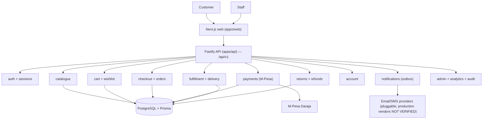
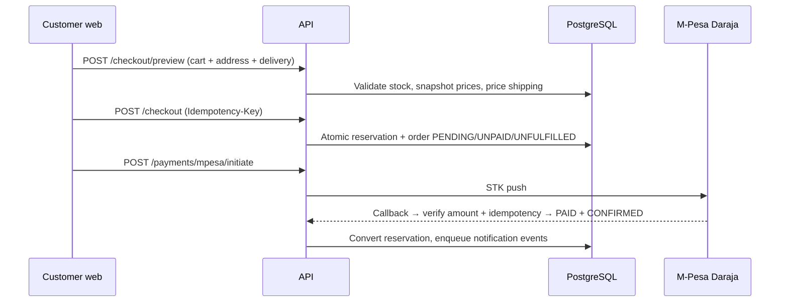

# Architecture

JB Mercantile is a monorepo (`apps/*`, `packages/*`, npm workspaces) with a Next.js frontend, a Fastify API, and PostgreSQL via Prisma. Single-store direct-to-consumer; no marketplace/vendor modules exist anywhere in code.

## System Overview

## Frontend (`apps/web`)

Next.js 14 App Router. Public storefront (`/`, `/shop`, `/search`, `/products/[slug]`, `/categories/[slug]`, `/collections/[slug]`, `/cart`, `/checkout`, `/order-confirmation/[orderNumber]`, `/wishlist`, `/login`, `/register`, `/returns`), customer account (`/account/*`, 14 pages), operations admin (`/admin/*`, 20+ pages). Thin server wrappers over client components; data via `lib/shopping-api.ts`, `lib/admin-api.ts`, `lib/analytics-api.ts` (`credentials: include`, JSON, `Error(body.error.message)`). Catalogue demo data is static in `lib/catalog.ts` (cutover to live `/catalog/*` APIs documented in code); cart/checkout/orders/payments already run on live APIs. See [CATALOGUE.md](CATALOGUE.md) and [UI-UX.md](UI-UX.md).

## Backend (`apps/api`)

Fastify with `@fastify/cookie`, `@fastify/cors`, `@fastify/helmet`, `@fastify/rate-limit`. All routes under `/api/v1` (see [API.md](API.md)). Shared packages: `@veyra/config` (env-derived app config), `@veyra/types` (unions mirroring Prisma enums), `@veyra/validation` (Zod schemas).

## Database

PostgreSQL 18 in development (local Docker). Prisma schema is authoritative: 50 models, 25 enums. Forward-only SQL migrations in `prisma/migrations/` applied with `psql` (the repo Prisma CLI has no working migrate command — see [DEPLOYMENT](../DEPLOYMENT.md)). Details in [DATABASE.md](DATABASE.md).

## External Services

| Service | State |
|---|---|
| M-Pesa Daraja | IMPLEMENTED (sandbox-capable; production ownership NOT VERIFIED) |
| Email provider | Pluggable (`log` / `mock` / `smtp` stub) — production vendor NOT VERIFIED |
| SMS provider | Pluggable (`mock` / `log`) — production vendor NOT VERIFIED |
| Object storage / CDN | NOT VERIFIED — `CLOUDINARY_*` vars exist in `.env.example` but no wired usage found in code |
| Product imagery (storefront demo) | Unsplash remote images (`next.config.mjs` remote pattern) |

## Request Flow (checkout → payment → fulfillment)

## Authentication & Authorization

Cookie session (`veyra_session`, HttpOnly, SameSite Lax, Secure in production, 7-day expiry, server-side revocation). Passwords bcrypt. Only `ACTIVE` accounts authenticate (suspend/deletion revokes access immediately). Roles: `CUSTOMER`, `STAFF`, `ADMIN`, `SUPER_ADMIN` (central catalog in `apps/api/src/lib/permissions.ts`). Operations routes require staff or above; financial completion and customer suspend/reinstate require admin or above; role assignment requires super-admin. All authorization server-side; UI gates are UX-only. See [AUTHENTICATION.md](AUTHENTICATION.md).

## Background Work

No separate worker. Notification outbox is drained in-process (`setImmediate` after commit) with retry/backoff; admin can force-drain via `POST /admin/notifications/process`.

## Domain Boundaries

Identity (users, roles, sessions) · Catalogue (products, variants, categories, collections, attributes) · Inventory (stock, movements, reservations) · Shopping (cart, wishlist) · Orders (checkout, order lifecycle) · Payments (M-Pesa, transactions) · Fulfillment (deliveries, tracking) · Returns (returns, exchanges, refunds) · Customers (account, preferences) · Notifications (outbox, channels, preferences) · Administration (dashboard, customers, reviews, coupons, settings) · Analytics (reporting, exports) · Audit (append-only log).
