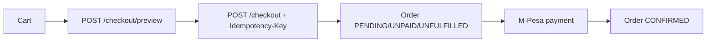

# Checkout (Cart, Wishlist, Checkout, Orders)

## Cart

Guest-capable cart (`GET /cart`, item add/update/remove/clear, quantity 1–20 per line). Prices shown are provisional (`priceOverride ?? basePrice`); totals become authoritative only at checkout preview. Stock problems surface as notices (price changed, limited quantity, out of stock). Cart intent is **not** inventory reservation — see [INVENTORY.md](INVENTORY.md).

## Wishlist

Authenticated wishlist (`GET/POST/DELETE /wishlist…`); toggle from cards and PDP with toast feedback; account mirror at `GET /account/wishlist`.

## Checkout Flow

1. **Options**: customer picks a delivery method (`PICKUP`, `LOCAL_DELIVERY`, `COURIER`) + zone; manual KE address required except pickup; saved addresses reusable.
2. **Preview** validates everything: customer (name/email/phone incl. `+254` normalization), product+variant `ACTIVE`, quantities vs `available`, price snapshots (mismatch → `409 CHECKOUT_REQUIRES_UPDATE` unless `confirmPriceChanges`), delivery method `ACTIVE` + zone/country match, shipping rate = highest `minOrderValue ≤ subtotal`. Currency hardcoded `KES`; discounts/tax currently 0.
3. **Place** (idempotent via `Idempotency-Key`; replays return the original result) atomically reserves stock, creates the order (`ORD-YYYYMMDD-<8HEX>`), snapshots items, appends history, and issues a guest confirmation token (SHA-256 hashed at rest) when needed.

## Orders

Separate state dimensions on `Order`: `status` (order lifecycle), `paymentStatus` (money), `fulfillmentStatus` (goods) — see [DATABASE.md](DATABASE.md). `OrderItem` freezes product/variant/price at purchase. Guest access via `?token=` + `x-confirmation-token`. Customers can claim guest orders, reorder, and track delivery from `/account/orders`. No order-cancel endpoint found — cancellation paths UNKNOWN.
