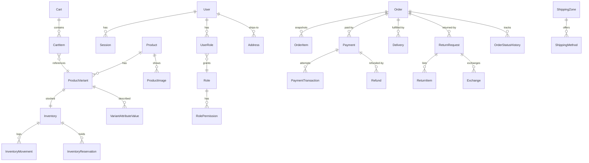

# Database

PostgreSQL via Prisma. Authoritative source: `prisma/schema.prisma` (50 models, 25 enums). Migrations in `prisma/migrations/` are forward-only, additive SQL applied with `psql` — never `prisma migrate reset` (see [DEPLOYMENT](../DEPLOYMENT.md)).

## Conventions

- UUID primary keys; `createdAt`/`updatedAt` timestamps throughout.
- Money as `NUMERIC(10,2)` (Prisma Decimal) — no float arithmetic on financial paths.
- Soft deletion where customer-visible (`deletedAt` on products/variants).
- Historical snapshots: `OrderItem` freezes name/variant/price at purchase; status changes append to `OrderStatusHistory` / `ReturnStatusHistory` / `DeliveryStatusHistory`.
- Numbering: `ORD-YYYYMMDD-<8HEX>`, `RET-…`, `RFD-…`, delivery tracking `VYR-YYYYMMDD-<8HEX>`.

## Major Entities

| Domain | Models |
|---|---|
| Identity | `User`, `Session`, `PasswordResetToken`, `EmailVerificationToken`, `Role`, `Permission`, `UserRole`, `RolePermission` |
| Catalogue | `Category` (self-parented), `Collection`, `ProductCollection`, `Product`, `ProductImage`, `ProductVariant`, `Attribute`, `AttributeValue`, `VariantAttributeValue` |
| Inventory | `Inventory` (per variant: onHand, reserved, low-stock threshold), `InventoryMovement`, `InventoryReservation` |
| Shopping | `Cart`, `CartItem`, `Wishlist`, `WishlistItem` |
| Orders | `Order`, `CheckoutIdempotency`, `OrderItem`, `OrderStatusHistory` |
| Payments | `Payment`, `PaymentTransaction`, `Refund`, `RefundTransaction` |
| Fulfillment | `Address`, `ShippingZone`, `ShippingMethod`, `ShippingRate`, `Delivery`, `DeliveryStatusHistory` |
| Returns | `ReturnRequest`, `ReturnItem`, `ReturnStatusHistory`, `Exchange` |
| Engagement | `Coupon`, `CouponUsage`, `Review`, `Notification`, `NotificationDelivery`, `NotificationOutbox`, `NotificationTemplate`, `NotificationPreference`, `UserPreference` |
| Governance | `AuditLog` (append-only: actor, action, entity, before/after, IP, user-agent) |

## State Dimensions (separate axes, not one status)

- `OrderStatus`: `PENDING → CONFIRMED → PROCESSING → COMPLETED`, plus `CANCELLED`. No order-cancel endpoint found — cancellation paths UNKNOWN.
- `PaymentStatus`: `UNPAID → PENDING → PAID`, plus `FAILED`, `REFUNDED`, `PARTIALLY_REFUNDED`.
- `FulfillmentStatus`: `UNFULFILLED → PROCESSING → PACKED → SHIPPED → DELIVERED`, plus `RETURNED`.
- `DeliveryStatus`: `PENDING → PREPARING → PICKED → PACKED → READY_FOR_PICKUP / ASSIGNED → IN_TRANSIT → OUT_FOR_DELIVERY → DELIVERED / PICKED_UP`, plus `DELIVERY_ATTEMPTED`, `FAILED`.
- `ReturnStatus`: `REQUESTED → UNDER_REVIEW → APPROVED → RETURN_INITIATED → RECEIVED → INSPECTING → APPROVED_FOR_RESOLUTION → RESOLVED`, with `REJECTED` / `CANCELLED` exits.
- `RefundStatus`: `REQUESTED → PENDING → PROCESSING → SUCCEEDED`, plus `FAILED`, `CANCELLED`.
- `ExchangeStatus`: `REQUESTED → APPROVED → ALLOCATED → FULFILLING → COMPLETED`, plus `FAILED`, `CANCELLED` (code observed only creating `REQUESTED`; onward allocation flow UNKNOWN).
- `ReservationStatus`: `ACTIVE`, `CONVERTED`, `RELEASED`, `EXPIRED` (no `RELEASED/EXPIRED` transition code found — UNKNOWN).
- `UserStatus`: `ACTIVE`, `INACTIVE`, `SUSPENDED`, `DELETED`.

## ERD (core commerce)

## Transactional Boundaries

Checkout (reservation + order + snapshots), M-Pesa callback handling (transaction + inventory conversion + notification enqueue), restock/adjust (stock change + movement + audit), and refund creation run inside Prisma transactions. Notification outbox rows are written in the same transaction as the triggering event, then drained after commit.

## Seed

`prisma/seed.ts` creates `customer` / `staff` / `admin` roles, a product/inventory/order/fulfillment/notification permission set, a bootstrap admin (`admin@veyra.local`), and the shipping-zone baseline. The backend product database is otherwise empty by design (one `apparel` category, zero products).
