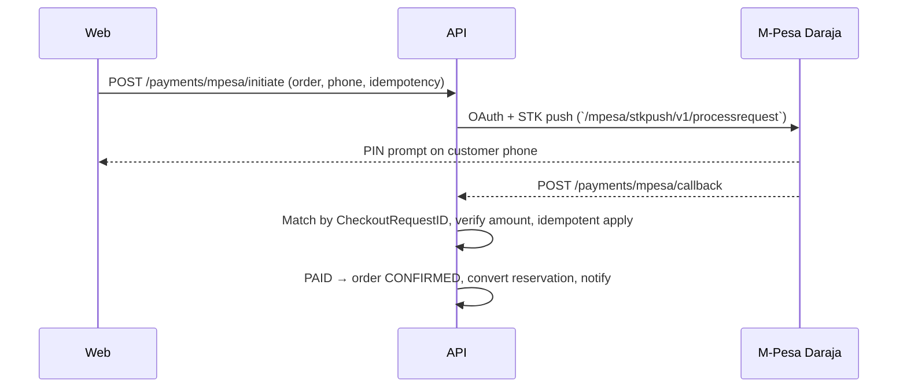

# Payments & M-Pesa

Payment abstraction with M-Pesa Daraja as the wired provider (`PaymentProvider`: `MPESA`, `CARD`, `PAYPAL`, `OTHER` — only M-Pesa flows are implemented).

## Language Rule

**Initiating an M-Pesa STK request is not payment.** Only a backend-verified callback establishes `PAID`. The frontend never determines payment success.

## M-Pesa Flow

- Phone must normalize to `254[17]XXXXXXXX`; amount must be a positive whole KES number matching the order.
- Callback requires Daraja's `stkCallback` shape (`MerchantRequestID`, `CheckoutRequestID`, `ResultCode`, metadata with amount/receipt/phone). Result `0` + amount match → `PAID` (receipt stored); amount mismatch → `FAILED` with `RECONCILIATION_REQUIRED` (never mark paid manually — see runbook).
- Duplicate callbacks are harmless: terminal transaction rows are never reprocessed, concurrent duplicates collapse via atomic row claims, and a `PAID` payment is never downgraded by a late failure (verified in `payments.test.ts`).
- Frontend polls `GET /payments/:paymentId/status` until `PAID`/`FAILED`. For delayed/missing callbacks the confirmation screen offers a manual check backed by `POST /payments/:paymentId/query`, which probes Daraja (`stkpushquery`) and folds concluded outcomes through the same guarded machinery; UNKNOWN probe results change nothing.
- Callback security: Daraja sends no signature — compensating controls are server-side correlation by `CheckoutRequestID`, expected-amount verification, atomic idempotency, terminal-state guards, and rate-limited owner-scoped status/query endpoints. The callback itself always answers `{ResultCode: 0}` so Safaricom stops retrying; unknown transactions ack without side effects.
- Every initiation and terminal transition writes a `PAYMENT_UPDATED` audit row (actor null for provider-driven events).

## Configuration

`MPESA_CONSUMER_KEY`, `MPESA_CONSUMER_SECRET`, `MPESA_SHORTCODE`, `MPESA_PASSKEY`, `MPESA_CALLBACK_URL`, `MPESA_ENVIRONMENT` (`sandbox`/`production`; legacy `M_PESA_*` aliases also read). Production refuses non-HTTPS callbacks and non-production mode. Sandbox shortcode default `174379`. Live-callback verification against Daraja: NOT VERIFIED. Production ownership (shortcode, settlement account): BLOCKER — see [BUSINESS-DECISIONS](../BUSINESS-DECISIONS.md).

## Payment States

`UNPAID → PENDING → PAID`, plus `FAILED`, `REFUNDED`, `PARTIALLY_REFUNDED` (set on manual refund completion). `PaymentTransaction` records every attempt with provider references and raw responses (never exposed to clients).
